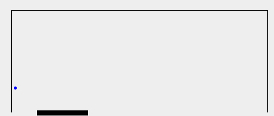

# Single Pong environment

The pong environment models one ball and one racket, see figure below.

The ball bounces on the walls and the racket. If the ball hits the area beside the racket, game is over.
Some characters of the game are:
* The ball speed is constant.
* The racket can have one of three speeds: left, still and right.
* The racket moves approx. 5 times faster than the ball.

The game may appear trivial but is surprisingly challenging to play for an artificial agent. For a time horizon of 10 steps, there are 3^10=59049 different action sequences.

## States

| **Variable(s)**      | **Value**  |
| ----------- | ----------- |
| xPosBall, yPosBall       | X and y position of ball      |
| xSpdBall, ySpdBall   | X and y speed of ball       |
| xPosRacket | Racket position       |
| xSpdRacket  | Racket speed       |
| rapidRacketChange  | Boolean variable that is true if racket speed changes from left to right, or vice versa, directly  |
| isTimerOn  | Boolean variable that is true if racket just has started to stand still       |
| collision  | Boolean variable that is true if ball just hits racket      |
| nofStepsStillBeforeCollision  | The number of time steps the racket is still before hitting ball       |
| nofSteps  | Total number of game steps      |

The motivation of some variables is present under section "Reward function".

## State updating
The ball position is a function of its speed. The ball speed is changed, in relevant dimension, when it hits wall or racket.
The boolean variable isTimerOn can be seen as the state of a finite state machine. It is switching to true if racket was moving but now is still and there is no collision. It remains in this state until starting motion or ball hits.
The variable nofStepsStillBeforeCollision is a counter increasing as long as isTimerOn is true.

## Reward function
The reward function is the sum of two terms: r1 and r2. R1 is zero if the ball is still else it is a negative number. The idea is to penalize energy consumption.
The term r2 is a way to encourage a good locking ball collision. Good locking means that a positive reward is given if the racket stands still for some steps before it gets hit by the ball.

## Terminal state
A game ends if the y position of the ball is below the very bottom of the game frame or if rapidRacketChange is true. To consider rapidRacketChange is a trick to decrease the search space.

